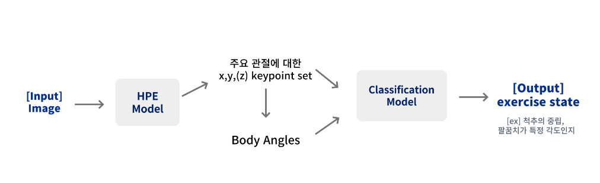

# 🧬 Overview



➡️ **운동 이미지가 들어오면 이미지에서 주요 관절의 keypoint를 추출한 뒤, 운동 자세가 올바른지 판별하는 Task**

# 📝 EDA(Exploratory Data Analysis)

### 🗂 Dataset

- [AIHub 피트니스 자세 이미지 데이터셋 EDA](https://www.aihub.or.kr/aihubdata/data/view.do?currMenu=115&topMenu=100&dataSetSn=231)

### 1. Dataset Features

- 24개의 keypoints set
- view1, view2, view3, view4, view5, view.active, view.img_key
- type, type_info.key, type_info.type, type_info.pose, type_info.exercise, condition1-5, value1-5

### 2. Train 운동 종목, Valid 운동 종목


### 3. 데이터 결측치 확인

**[4가지 운동 종목에 대하여 결측치 시각화]**


→ 확인 결과, 태깅이 잘못되거나 오류가 있는 데이터 제거

# 🌐 Human Pose Estimation

### 모델 실험 결과

| Model | mAP50 | inference time |
| --- | --- | --- |
| Mobilenet | 0.6538 | 52ms |
| Mobilenet (Aug) | 0.7146 | 52ms |
| Cid+HRNet | 0.8696 | 67ms |
| Cid+HRNet (pruning) | 0.8816 | 60ms |

### 모델 pth 다운로드
- [pth download](https://drive.google.com/drive/folders/1mZBgPznkQdGE9goX8L8ztUzkV7s8fgLZ?usp=sharing)

### 실행방법

- **train model**

```python
cd pose-estimation/mmpose
python tools/train.py
```

- **train pruning model**

```python
cd pose-estimation/mmpose
python tools/train_hrnet_prun.py
```

- **inference**

- [somang_mmpose_inference.ipynb](https://github.com/NaverMind/AIHealthCare/blob/main/AI/pose-estimation/mmpose/somang_mmpose_inference.ipynb)

### 모델 실험 결과 확인

- [wandb](https://wandb.ai/somang/HPE%20modesl?workspace=user-somang)

# 🌐 Tabular data Classification

| Model | acc | inference time |
| --- | --- | --- |
| LSTM | 0.6629 | 148ms |
| Random Forest | 0.6066 | 1238ms |
| LGBM | 0.5912 | 1675ms |
