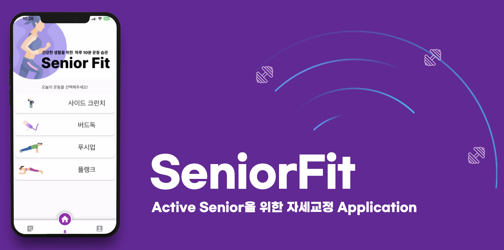
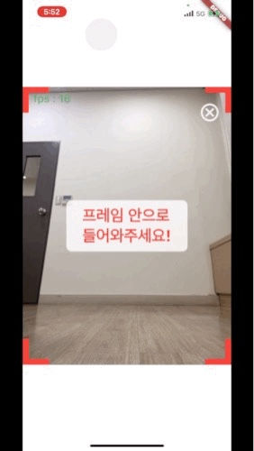
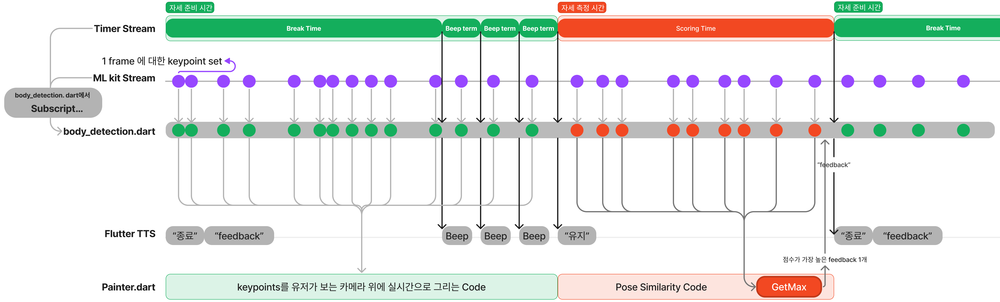

# Senior Fit


중장년층은 정확한 운동 자세 인지에 대한 어려움이 있습니다. 부정확한 운동자세는 심각한 통증을 유발할 가능성이 있습니다. 

시니어핏은 AI 기반의 자세 교정 어플리케이션을 제공합니다. 실시간 자세 분석과 음성 코칭 서비스를 통해 Personal Training을 받는 것과 유사하게 운동을 할 수 있습니다. 또한 중장년층의 운동 적합도를 고려한 선별된 운동 종목을 제공함으로써 보다 적절한 training을 제공합니다. 

# 기능 설명

## 1. 서비스

Senior Fit은 사용자가 운동 시작 전 운동 횟수를 선택 할 수 있습니다. 운동을 시작 후 사용자가 **운동 자세**를 취할 때 **운동별 중요부위마다 scoring**을 합니다. 1회 운동이 끝날 때 마다 가장 낮은 score를 가진 부위를  **FlutterTTS**를 이용해 **음성으로 피드백**을 해줍니다. 

## 2. 운동 자세 튜토리얼

**↘️ 스탠딩 사이드 크런치**



**[Youtube link]**

[https://youtube.com/shorts/3dA4EJ3wANs?feature=share](https://youtube.com/shorts/3dA4EJ3wANs?feature=share)

**↘️ 버드독**


**[Youtube link]**

[https://www.youtube.com/watch?v=uBZl8x_Vclc](https://www.youtube.com/watch?v=uBZl8x_Vclc)

## 3. Feedback Type

**↘️ 스탠딩 사이드 크런치**

- 팔꿈치와 무릎을 더 붙이세요!
- 무릎을 측면으로 옮겨주세요!
- 손을 머리뒤에 위치해주세요!
- 척추를 좀 더 펴주세요!

**↘️ 버드독**

- 왼쪽 팔을 앞으로 쭉 뻗어주세요!
- 오른쪽 손을 어깨 아래에 놓아주세요!
- 왼쪽 다리는 지면과 90도로 만들어주세요!
- 오른쪽 다리를 뒤로 쭉 뻗어주세요!
- 오른쪽 다리를 엉덩이 높이까지 들어주세요!

## 4. Result + myData


## 5. UI Flow


# 기술 설명

## 1. **<자세 교정받기>** 구현



body_detection.dart에서는 Timer stream과 MLkit 를 이용해 좌표가 event로 넘어오는 stream 두개를 구독하고 있으며 Timer stream이 초록색(break, beep time)일때는 mlkit stream에서 넘어온 좌표를 이용해 사용자의 카메라위에 좌표만 시각화 해주고 빨간색(scoring time) 일때는 넘어온 좌표를 각 운동별 scoring code로 넘겨주고 유저에게는 빨간색으로 시각화 한다.

## 2. BlazePose

****BlazePose: On-device Real-time Body Pose tracking****

BlazePose는 모바일에서도 human pose estimation에 대한 real-time inference가 가능하다. Google Pixel 2 기준으로 30fps로 33개의 keypoint를 출력한다.


## 3. PoseSimilarity

Cosine Similarity 이용하여 정답 자세와 사용자 자세간 유사도 판별

<aside>
📶 **Cosine Similarity**


</aside>

## 4. Scoring Method

**1) 신체부위별 resize**


**2) Normalization**


**3) Scoring**

↘️ **사이드 크런치**

- 다리 Score = Cosine Similarity  80% + Angle 20%
- 다리 외 Score = Cosine Similarity  50% + Angle 50%
- score scaling from 0 to 100
- Threshold = 85

↘️ **버드독**

- Score = Cosine Similarity * 50 + Angle
- Threshold = 35

# 기술스택

## AI

| Python |
| --- |
| Pytorch |
| Numpy |
| Pandas |
| Matplotlib |
| Tensorflow |
| Sklearn |
| Opencv |
| ML Kit Flutter Plugin |

## Front-End

| Language | Mobile-App Framework |
| --- | --- |
| Dart | Flutter |

| 사용한 오픈소스 패키지 | 용도 |
| --- | --- |
| body_detection 0.0.3 | mlkit와 camera |
| fl_chart 0.55.2 | 그래프 작성 |
| flutter_beep 1.0.0 | 구분음 |
| flutter_tts 3.6.0 | 피드백 음성 |
| drift 2.2.0 | Database |
| sqlite3_flutter_libs 0.5.0 | Database |

## Back-end

- Database(SQLite)

# Usage(프로젝트 사용법)

## Android

- apk build

```bash
$ git clone https://github.com/NaverMind/AIHealthCare.git
$ cd senior_fit_1
$ flutter build apk --release
```

# Docs

Introduction presentation

[Short version video](https://youtu.be/ZTaQt69vYvg)

[Full version video](https://youtu.be/KDV2HWj9Uaw)

# 팀원

<div align="left">
  <table>
    <tr>
      <td align="center">
        <a href="https://github.com/kkt4828/">
          
        </a>
      </td>
      <td align="center">
        <a href="https://github.com/Somang-Kang">
          
        </a>
      </td>
      <td align="center">
        <a href="https://github.com/mata1139">
          
        </a>
      </td>
    </tr>
    <tr>
      <td align="center">
        <a href="https://github.com/dkswndms4782/">
          안유진(AI)
        </a>
      </td>
      <td align="center">
        <a href="https://github.com/Somang-Kang">
          강소망(AI)
        </a>
      </td>
      <td align="center">
        <a href="https://github.com/Chi-Honey">
          송치헌(APP)
        </a>
      </td>
    </tr>
  </table>
</div>

<br/>
<div id="5"></div>
